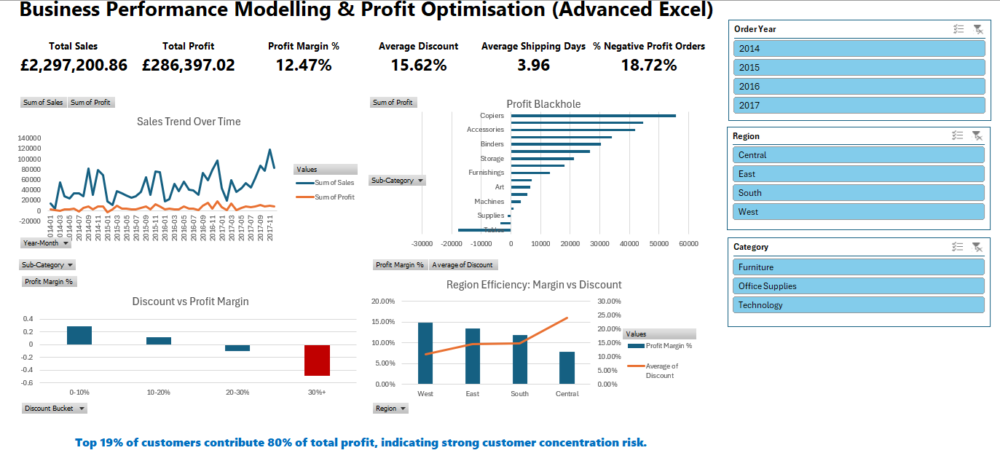
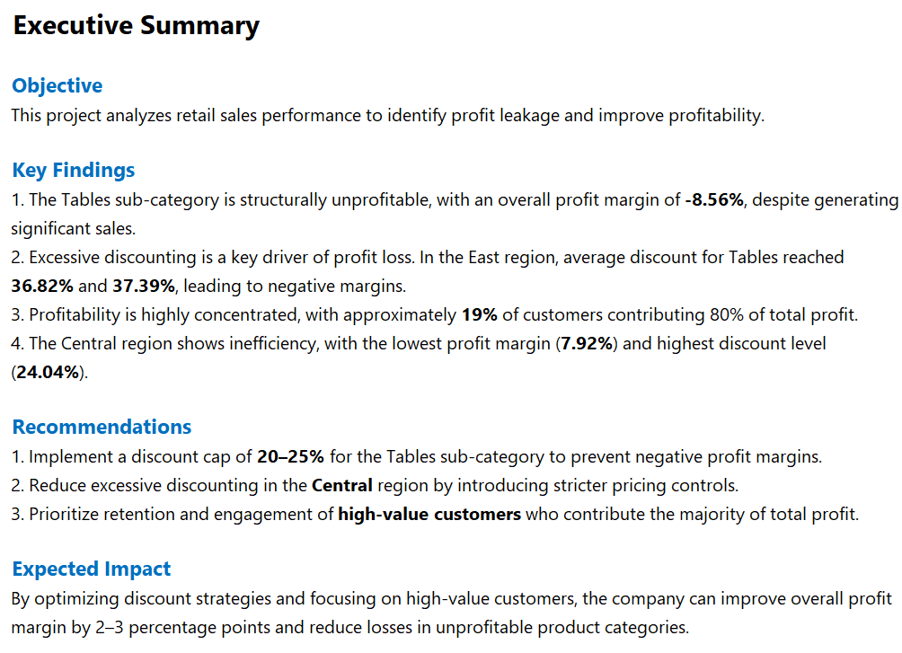

# Business-Performance-Modelling-Profit-Optimisation-Advanced-Excel-
Excel dashboard project analyzing retail sales, profit leakage, discount impact, customer concentration, and regional efficiency.

## Project Overview
This project analyzes retail sales performance to identify profit leakage and improve profitability. The analysis focuses on product performance, discount impact, customer concentration, and regional efficiency using Advanced Excel, Power Query, PivotTables, and Data Model measures.

## Business Problem
A retail business experienced sales growth, but profit did not increase proportionally. The objective of this project was to identify:
- Which products were driving profit loss
- Whether discounting was eroding margin
- Which customers contributed most of total profit
- Which regions were operationally inefficient

## Tools Used
- Excel
- Power Query
- PivotTables
- Data Model / DAX Measures
- Dashboard Design
- Business Analysis

## Dashboard Preview

## Executive Summary Preview

## Key Findings
- The **Tables** sub-category is structurally unprofitable, with an overall profit margin of **-8.56%**
- High discount levels significantly reduce profitability, especially in the East region, where Tables discount reached **36.82%** and **37.39%**
- Approximately **19% of customers contribute 80% of total profit**
- The **Central** region has the **lowest profit margin (7.92%)** and the **highest average discount (24.04%)**

## Recommendations
- Implement a **20–25% discount cap** for the Tables sub-category
- Reduce excessive discounting in the Central region
- Prioritize retention of high-value customers who generate the majority of total profit

## Expected Impact
By optimizing discount strategies and focusing on high-value customers, the company could reasonably improve overall profit margin by **2–3 percentage points** and reduce losses in unprofitable product categories.

## Files
- [Download the Excel Dashboard] (https://github.com/BoKwokProjects/Business-Performance-Modelling-Profit-Optimisation-Advanced-Excel-/blob/main/files/Business%20Performance%20Modelling%20%26%20Profit%20Optimisation%20(Advanced%20Excel).xlsx))

## Author
Created by Bo Kwok
